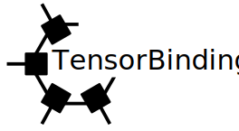

**TensorBinding.jl**  
*Compressing Condensed Matter Problems with Tensor Networks*

[](https://TensorBinding.github.io/TensorBinding/stable/)
[](https://TensorBinding.github.io/TensorBinding/dev/)
[](https://github.com/TensorBinding/TensorBinding/actions/workflows/CI.yml?query=branch%3Amain)
[](https://codecov.io/gh/TensorBinding/TensorBinding)

**TensorBinding.jl** is a Julia package for constructing and studying tight-binding Hamiltonians as **Matrix Product Operators (MPOs)** in the *quantics binary* (QTT) representation. A system of *N = 2<sup>L</sup>* sites is encoded in *L* qubit sites, keeping bond dimensions small (typically ≤ 10) for physically relevant models. Arbitrary hopping matrices are compressed automatically via **Quantics Tensor Cross Interpolation (QTCI)**.

---

### Installation

```julia
using Pkg
Pkg.add("TensorBinding")
```

Dependencies are resolved automatically: [ITensors.jl](https://github.com/ITensor/ITensors.jl), [ITensorMPS.jl](https://github.com/ITensor/ITensorMPS.jl), [QuanticsTCI.jl](https://github.com/tensor4all/QuanticsTCI.jl), [FFTW.jl](https://github.com/JuliaMath/FFTW.jl), and [CUDA.jl](https://github.com/JuliaGPU/CUDA.jl) (installed but only active when calling GPU functions — no GPU required for CPU workflows).

---

### Quick Start

See the [`examples/`](examples/) folder for notebooks covering the main workflows.

---

### Key Features

**Hamiltonian construction**
- 1D: nearest-neighbour chain, SSH (uniform and sublattice-explicit), Aubry–André–Harper quasicrystal, uniform with on-site potential
- 2D: square, triangular, honeycomb, kagomé, Lieb, and dice lattices — including sublattice-explicit models with an explicit unit-cell index
- Generic *n*th-nearest-neighbour hopping on any 2D geometry (`add_hopping_2D!`): uniform, direction-dependent, site-dependent, or fully position+direction-dependent amplitude functions
- Arbitrary hopping matrix `f(i,j)` compressed via QTCI (`hopping2MPO`)

**Geometry & auxiliary DOF extensions**
- Real-space geometry functions for all lattices; geometric centroid helpers
- Prepend or postpend spin-½ and Nambu indices (`add_spin!`, `add_superconductivity!`)
- Zeeman coupling, Ising SOC, Rashba SOC; singlet *s*-wave, *p*-wave (Kitaev), and arbitrary custom pairing (`type=:custom`)
- Auxiliary indices placeable at front (`:pre`) or back (`:post`) of the site chain

**Kernel Polynomial Method (KPM)**
- Chebyshev expansion of spectral functions, LDOS, Green's functions, and density matrices
- Kernels: Jackson (default), Lorentz, Fejér, Dirichlet, HODC
- Three complementary modes: MPO (full operator), diagonal/online (memory-efficient LDOS), MPS (reference-state propagation)
- Band structure *A(k,ω)* via QFT conjugation (`get_bands`); supports spin, BdG, layer, and sublattice projections via `aux_proj`
- Density matrix purification: McWeeny (cubic convergence) and SP2 (electron-number controlled)

**Topological invariants**
- Real-space Chern marker (2D) and winding-number density (1D) via KPM or purification
- Quenched and flat position operators; compatible with all lattice geometries and auxiliary DOFs

**Non-Hermitian systems**
- Hermitization into a 2×2 block form with a placeable auxiliary index (`:pre`/`:post`)
- Four KPM spectral algorithms on a complex energy grid (`nh_spectrum_grid`):
  - `:scalar` — MPO×MPO partial recursion, total DOS
  - `:diag` — same recursion + site-resolved diagonal LDOS MPS
  - `:mps` — dual-chain MPS at a single probe site, O(χ_H·χ_ψ)
  - `:stochastic` — Monte Carlo trace with random product-state probes, no MPO×MPO products
- Complex on-site potentials, spatially modulated loss/gain, and non-reciprocal skin-effect hopping

**Real-time evolution**
- Pure states: TDVP (time-independent and time-dependent *H*); compressed propagator MPO via QTCI
- Density matrices (Hermitian): RK4 integration of *dρ/dt = −i[H(t), ρ]*
- Density matrices (non-Hermitian): RK4 integration of *dρ/dt = −i(Hρ − ρH†)*

**Many-body: SCF & exciton**
- Self-consistent mean-field (Hubbard): Hartree/CDW, magnetic, and BdG pairing channels
- Electron–hole Hamiltonian on an interleaved 2*L*-site quantics chain; contact interaction; MPS probes in real and momentum space

**GPU acceleration**
- CUDA-accelerated counterparts for KPM, band structure, topology, SCF, and two-particle LDOS
- Setup (Hamiltonian construction, k-path bookkeeping) stays on CPU; Chebyshev recurrence and MPO products offloaded to GPU
